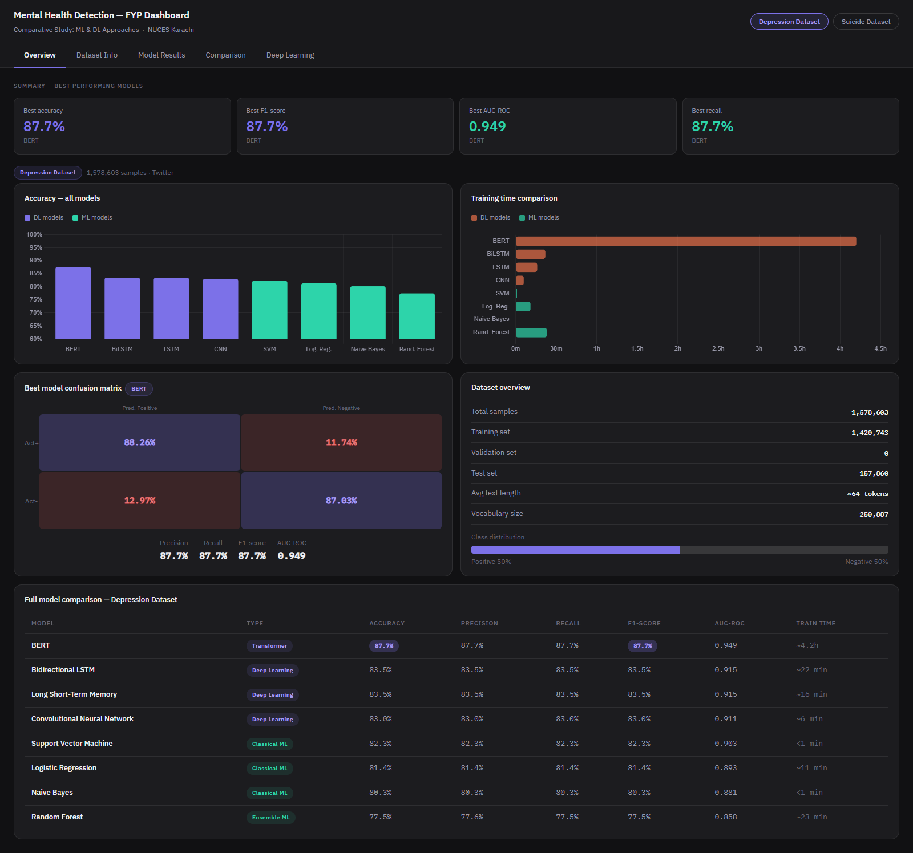
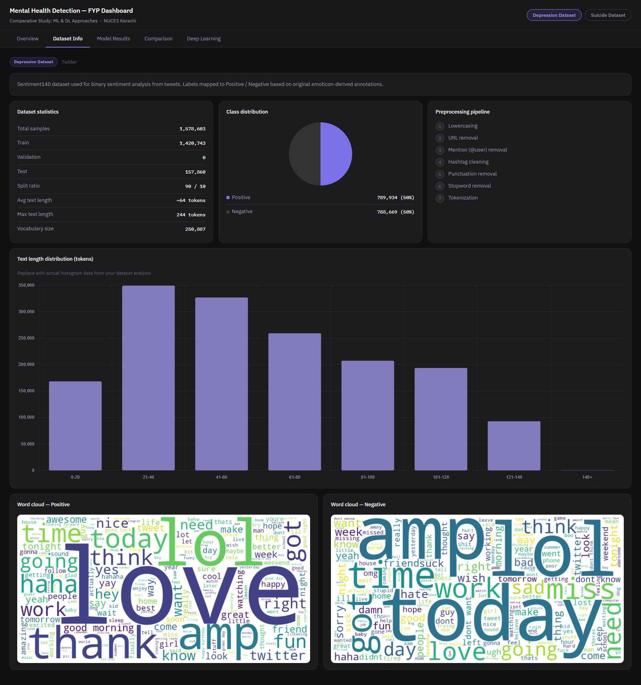
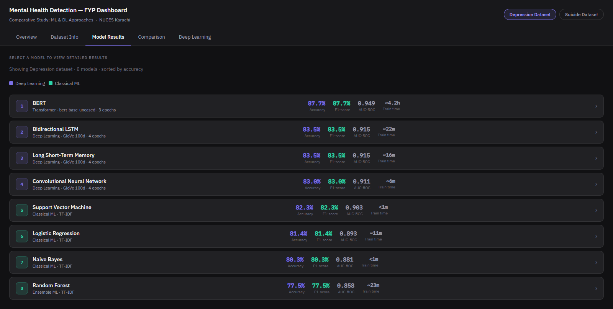
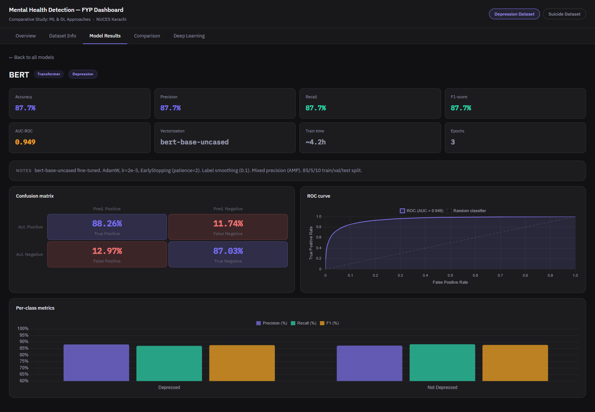
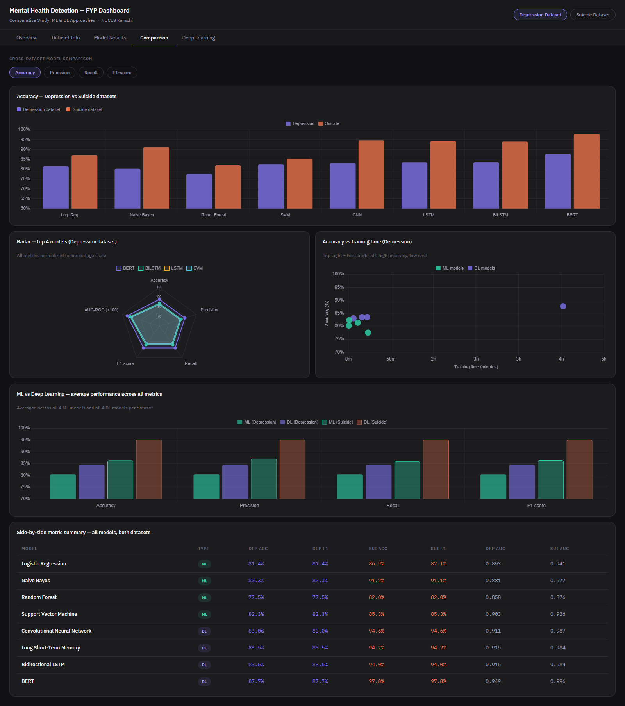
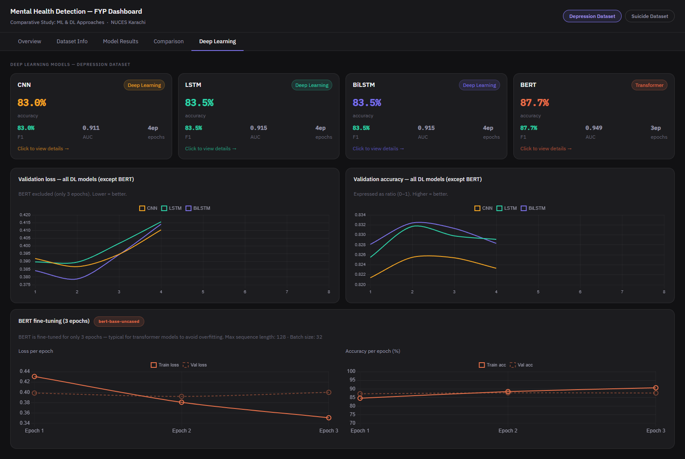

<div align="center">

# 🧠 Mental Health Detection — FYP Dashboard

**An interactive research dashboard visualizing ML & DL approaches to mental health detection from social media text.**

[](https://react.dev)
[](https://www.chartjs.org/)
[](https://opensource.org/licenses/MIT)

</div>

---

## Overview

This dashboard provides an interactive, visual comparison of **16 model implementations** across two mental health detection pipelines — Depression Sentiment Analysis and Suicide Ideation Detection. It is pre-populated with the evaluation results generated by the model training scripts. It presents classification metrics, confusion matrices, ROC curves, training histories, and cross-model comparisons in a unified dark-themed interface.

---

## Screenshots

| Overview | Dataset Info |
|:---:|:---:|
|  |  |
| Summary metrics, accuracy bar chart, training time, confusion matrix & full comparison table | Dataset stats, class distribution, text length histogram, preprocessing pipeline & word clouds |

| Model Results | Model Results — BERT Detail |
|:---:|:---:|
|  |  |
| Ranked list of all 8 models with accuracy, F1, AUC-ROC & train time | Per-model drill-down with confusion matrix, ROC curve & per-class metrics |

| Comparison | Deep Learning |
|:---:|:---:|
|  |  |
| Cross-dataset comparison, radar chart, accuracy vs training time scatter & ML vs DL averages | DL model cards, validation loss/accuracy overlay curves & BERT fine-tuning section |

---

## Tech Stack

| Technology | Purpose |
|:---|:---|
| **React 18** | Frontend framework |
| **Chart.js 4 + react-chartjs-2** | All charts (bar, line, radar, scatter, pie, ROC curves) |
| **IBM Plex Sans + IBM Plex Mono** | Typography (Google Fonts) |
| **Pure CSS dark theme** | Styling — no external UI library |

---

## Folder Structure

```
Dashboard/
├── screenshots/                           ← Dashboard screenshots
├── public/                                
│   ├── index.html                         
│   └── images/                            ← Word cloud images
│       ├── dep_wordcloud_positive.png     
│       ├── dep_wordcloud_negative.png     
│       ├── sui_wordcloud_positive.png     
│       └── sui_wordcloud_negative.png     
├── src/                                   
│   ├── data/                              
│   │   ├── depressionData.js              ← Depression dataset stats & all model results
│   │   └── suicideData.js                 ← Suicide dataset stats & all model results
│   ├── components/                        
│   │   ├── Overview.js                    ← Tab 1
│   │   ├── DatasetInfo.js                 ← Tab 2
│   │   ├── ModelResults.js                ← Tab 3
│   │   ├── Comparison.js                  ← Tab 4
│   │   └── DeepLearning.js                ← Tab 5
│   ├── App.js                             ← Main app shell + tab navigation
│   ├── index.js                           ← React entry point
│   └── index.css                          ← Global dark theme styles
├── package.json                           
├── package-lock.json                      
└── README.md                              
```

---

## Setup & Run

### Prerequisites
- [Node.js 16+](https://nodejs.org)

### Steps

```bash
# 1. Navigate into the Dashboard folder
cd Dashboard

# 2. Install dependencies (first time only)
npm install

# 3. Start the development server
npm start
```

The dashboard opens automatically at **http://localhost:3000**

---

## Dashboard Tabs

The **Depression Dataset / Suicide Dataset** toggle in the top-right switches all tabs (except Comparison, which shows both) to the selected dataset's data.

| Tab | What it shows |
|:---|:---|
| **Overview** | Summary metrics, accuracy bar chart, training time, best model confusion matrix, full comparison table |
| **Dataset Info** | Dataset stats, class distribution pie, text length histogram, preprocessing steps, word clouds |
| **Model Results** | Clickable list of all 8 models → drill into detail page with confusion matrix, ROC curve, and per-class metrics |
| **Comparison** | Side-by-side both datasets, radar chart (top 4 models), scatter plot (accuracy vs training time), ML vs DL group averages |
| **Deep Learning** | DL model cards, validation loss/accuracy overlay curves, BERT special section, per-model training curve viewer |

---

## Common Issues

**`Module not found` error** → Run `npm install` again.

**Charts not rendering** → Make sure you're on Node 16+. Try deleting `node_modules/` and running `npm install` again.

**Word clouds not showing** → Check that image filenames exactly match the paths in `depressionData.js` / `suicideData.js`, and that images are in `public/images/`.

**Port 3000 already in use** → Run `npm start` — it will ask to use port 3001 automatically, press `Y`.

---

<div align="center">

Developed as part of the Final Year Project — Spring 2026
<br/>
FAST School of Computing, NUCES Karachi

</div>
